<p align="center"></p>

<h3 align="center">Your health record follows you, everywhere in Benin.</h3>

<p align="center">One record per citizen, found by their NPI alone, from the health centre to the cashier, the pharmacy and their own phone.<br>
Built on <strong>HL7 FHIR R4</strong>, owned by no vendor, ready to run on the State's own infrastructure.</p>

<p align="center">
  <a href="https://lafia.stephanebah.page"><strong>Try the live demo →</strong></a>
  &nbsp;·&nbsp; <a href="docs/architecture.md">Architecture</a>
  &nbsp;·&nbsp; <a href="docs/adr/">Decisions</a>
  &nbsp;·&nbsp; <a href="#run-the-stack">Run it locally</a>
</p>

<p align="center"><sub>Demonstration platform: every person, visit and record in it is synthetic.</sub></p>

<p align="center">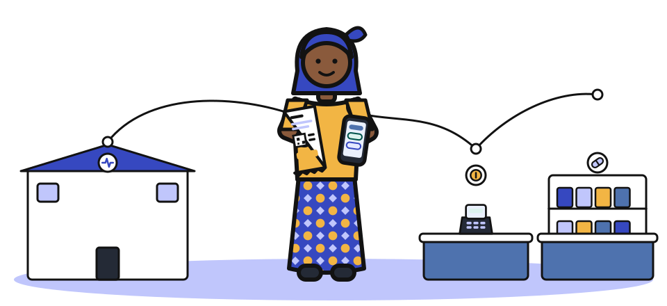</p>

---

## Today, medical memory is scattered

<table>
<tr>
<td align="center" width="25%">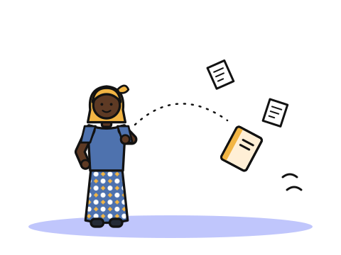<br>The paper booklet gets lost.</td>
<td align="center" width="25%">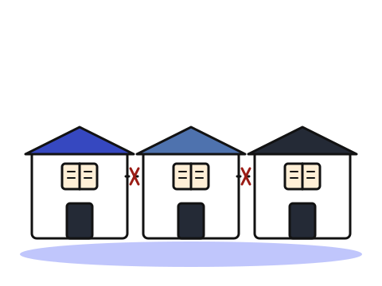<br>Each facility keeps its own register.</td>
<td align="center" width="25%">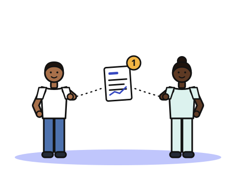<br>A lab result exists as one paper copy.</td>
<td align="center" width="25%">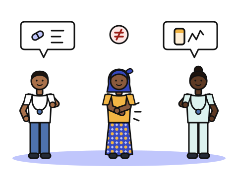<br>Without the history, each doctor guesses.</td>
</tr>
</table>

The patient is the only link between their carers. Lafia replaces that with **one shared memory and one door per profession**. It is not another app on top of the problem: it is the ground that apps stand on.

## One visit, end to end

Awa has a fever. Follow her through the platform:

<table>
<tr>
<td align="center" width="20%" valign="top">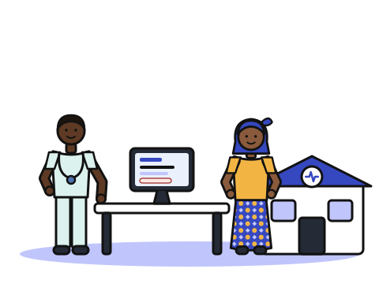<br><b>Health centre</b><br><sub>The soignant finds Awa by her NPI, opens a cas, writes the visite and <b>issues the ordonnance</b>.</sub></td>
<td align="center" width="20%" valign="top"><br><b>The reçu</b><br><sub>Awa leaves with <b>the ordonnance number</b>, its QR code and her code carnet.</sub></td>
<td align="center" width="20%" valign="top"><br><b>Cashier</b><br><sub>The number is typed once. Lines arrive priced; <b>nothing is re-typed</b>.</sub></td>
<td align="center" width="20%" valign="top">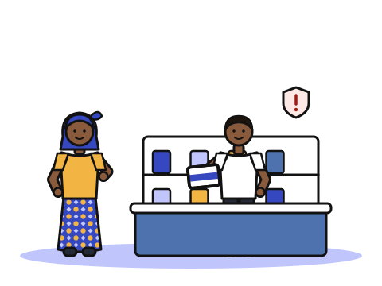<br><b>Pharmacy</b><br><sub>The pharmacist sees the paid lines and <b>the allergies before handing over</b>.</sub></td>
<td align="center" width="20%" valign="top">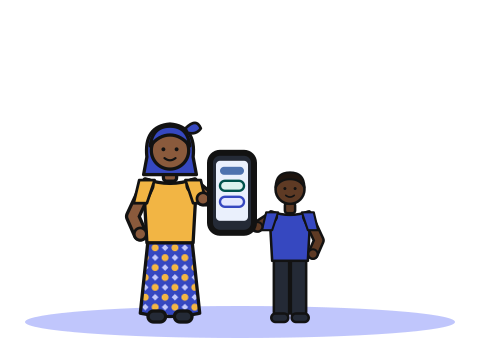<br><b>Her carnet</b><br><sub>On her son's phone, Awa sees what is paid, collected, and <b>how to take her treatment</b>.</sub></td>
</tr>
</table>

## The products

Six applications, each on its own subdomain, each with its own service. They share one record and nothing else.

<table>
<tr>
<td width="170" align="center" valign="top"></td>
<td valign="top">

### Lafia Soin
**For doctors and nurses. The whole patient, on one screen.**

- **Find anyone by NPI.** No new number and no card to issue. A search shows identity and allergies, never the clinical record.
- **A patient workspace.** A permanent banner shows identity, age, blood group, allergies, history and long-term treatments. Under it are three tabs: *Synthèse* (open cas, latest mesures, temperature chart), *Cas* (the timeline) and *Nouvelle visite*.
- **The cas de visite** ties visits, measurements, diagnoses and ordonnances into one health problem, from first symptom to closure, even across facilities.
- **Guided visit form.** Motif → mesures → diagnostic → ordonnance, from catalogues rather than free text. The posology is picked as moments × days, then the reçu is printed.
- **The paper past, on screen.** A *Documents* tab holds numérised papers and their reviewed Transcriptions, which read as a life story with the paper pages alongside.
- **Emergencies stay possible.** Without a relation de soin, a vital emergency still opens the record, with a declared reason, and that access is traced.

<sub><code>soin.&lt;domain&gt;</code> · <code>services/soin</code> · <code>web/soin</code></sub>
</td>
</tr>

<tr>
<td align="center" valign="top"></td>
<td valign="top">

### Lafia Caisse
**For cashiers. Type a number, collect the payment.**

- Open an ordonnance by its number, typed or scanned from the QR code on the reçu.
- The lines arrive priced from the facility's own tariffs. Tick what the patient pays now and print the récépissé.
- **Least privilege by design:** the cashier sees the ordonnance and its amounts, never the diagnosis.

<sub><code>caisse.&lt;domain&gt;</code> · <code>services/caisse</code> · <code>web/caisse</code></sub>
</td>
</tr>

<tr>
<td align="center" valign="top"></td>
<td valign="top">

### Lafia Pharmacie
**For hospital pharmacies and town officines. Hand over safely.**

- The paid lines not yet handed over, and nothing else.
- **Stops on an allergy.** A line that matches a known allergy blocks until the pharmacist acknowledges it.
- **Partial délivrance is normal.** Hand over what is in stock and the rest stays to collect, visible to everyone downstream.
- **Officines too.** A pharmacy in town reaches the ordonnance by its number and declares the lines it handed over.

<sub><code>pharmacie.&lt;domain&gt;</code> · <code>services/pharmacie</code> · <code>web/pharmacie</code></sub>
</td>
</tr>

<tr>
<td align="center" valign="top">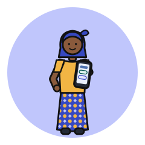</td>
<td valign="top">

### Lafia Carnet
**For citizens. Your record, readable without reading.**

- Open it with your NPI and the code carnet printed on your reçu. There is no account to create.
- **Reads in pictures.** It shows what is paid, what is left to collect, and when to take each medicine (morning, noon, evening, night), with large pictograms and status badges.
- *Ma santé* shows your history and long-term treatments. *Mes documents* holds your numérised papers. *Par établissement* shows your story at each facility, in date order.
- **See who opened your record, and when.** Every access, emergency access included, appears in your own journal.

<sub><code>citoyen.&lt;domain&gt;</code> · <code>services/citoyen</code> · <code>web/citoyen</code></sub>
</td>
</tr>

<tr>
<td align="center" valign="top"></td>
<td valign="top">

### Lafia Numérisation
**For desk agents. Bring the paper past in, in a single visit.**

- The citizen comes to the desk **once**, with their old carnets, lab reports and prescriptions, and leaves with all of them.
- **Identity checked first.** The agent enters the NPI, checks an ID document, then confirms the name and birth year before anything is added.
- **Rigorous capture.** Every page is checked for blur, framing and light. The agent checks the page count and puts pages back in order, and damaged paper gets an explicit, traced override.
- **The agent adds Documents, never clinical values.** A wrong allergy typed at a desk is dangerous, so turning paper into facts is a soignant's act.

<sub><code>numerisation.&lt;domain&gt;</code> · <code>services/numerisation</code> · <code>web/numerisation</code></sub>
</td>
</tr>

<tr>
<td align="center" valign="top"></td>
<td valign="top">

### Lafia Relecture
**For review agents. Turn scans into a record people can trust.**

- **Side by side.** The pages scroll on the left and the Transcription reads on the right, cut into volets (one visit, one lab result, one prescription each). Each volet points to its pages.
- **Correct, reorder, split, merge,** add a photo of a page or a zone of it, and mark what is illegible. Dates are typed the way the paper writes them, and the draft saves itself.
- **Double confirmation, then Contrôle.** Each volet is ticked against its pages, then the whole Transcription is confirmed with a summary of the changes. A second reviewer accepts it or sends it back.
- **Pseudonymised.** Reviewers never see whose record it is. *Ma semaine* tracks their quota, what is done and what came back.
- **Soignants validate the facts** that a machine reading proposes, before anything enters the record.

<sub><code>relecture.&lt;domain&gt;</code> · <code>services/relecture</code> · <code>web/relecture</code></sub>
</td>
</tr>
</table>

Behind them, two services have no screen of their own:

- **identite** handles sign-in and holds the only signing key. It issues short-lived signed session tokens and the code carnet printed on every reçu.
- **extraction** is the machine reading of numérised pages, on the internal network only. Today it is a demonstration stand-in behind a fixed contract (ADR 0009), so a real model can replace it without touching anything else.

## Four choices that change everything for the patient

<table>
<tr>
<td align="center" width="25%" valign="top">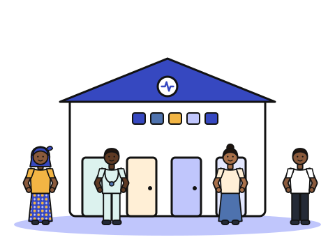<br><b>One memory, one door per profession</b><br><sub>Every medical fact lives in one place. Each role enters through its own door and sees only what its work needs.</sub></td>
<td align="center" width="25%" valign="top">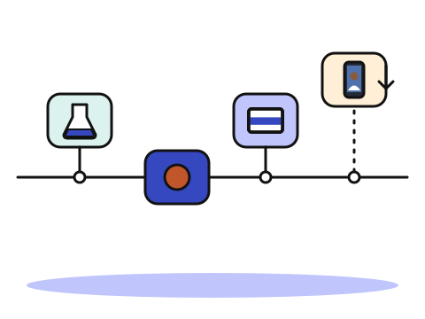<br><b>Interoperable from day one</b><br><sub>HL7 FHIR R4 in an unmodified HAPI server. The record belongs to the patient, not to a software vendor.</sub></td>
<td align="center" width="25%" valign="top">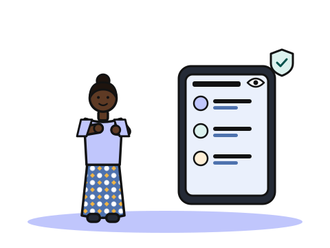<br><b>Security you can see</b><br><sub>A soignant opens a record only while treating that patient. Every access is traced, and the citizen sees it.</sub></td>
<td align="center" width="25%" valign="top">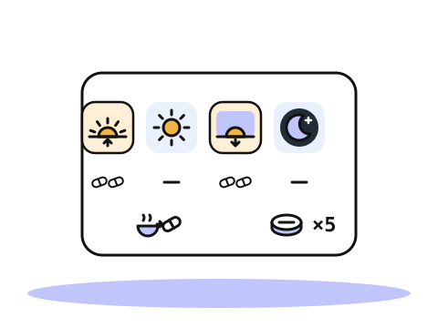<br><b>Understood without reading</b><br><sub>Pictograms, icons with words, and statuses shown as shapes and not only colours.</sub></td>
</tr>
</table>

## The foundation

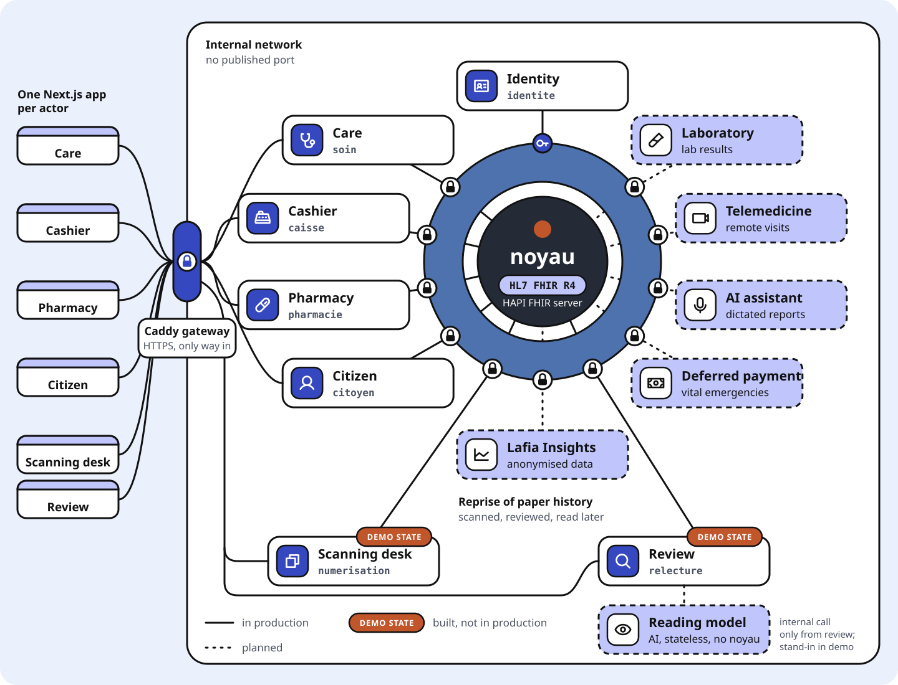

**The noyau.** Every medical fact lives in one place as a standard **HL7 FHIR R4** resource in an unmodified HAPI FHIR server: each visite, mesure, diagnostic, ordonnance, délivrance, Document, and each access to the record. The patient is identified by their NPI; Lafia invents no identifier of its own. The record is append-only: a correction is a new version, and history stays readable. The noyau publishes no port and has no route to the internet.

**The contract.** Between the noyau and anyone who wants its data stand the same four rules, enforced by every service:

- **Signed tokens.** identite alone holds the signing key. Each service checks tokens itself with the public key, so a compromised service cannot forge one.
- **Least privilege.** Each role reaches what its work needs and no more.
- **Relation de soin.** A soignant opens a dossier only when their établissement is treating that patient. A vital emergency opens it anyway, with a stated reason.
- **Every access traced.** Each read or write writes an `AuditEvent` into the noyau, and the citizen sees it in their carnet.

**The services.** A service translates its actor's work into FHIR; services never call each other. The only door from outside is the gateway, which sends each subdomain to its own service and nothing else. The network enforces this, and the test suite checks it.

## Built to grow

Tomorrow's services join the same way: one service that speaks FHIR to the noyau, one application and one line in the gateway. No data is copied, no database is added and no existing code changes.

<table>
<tr>
<td align="center" width="25%" valign="top">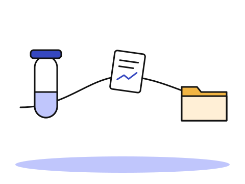<br><b>Laboratoire</b><br><sub>Results filed straight into the cas de visite, without paper.</sub></td>
<td align="center" width="25%" valign="top">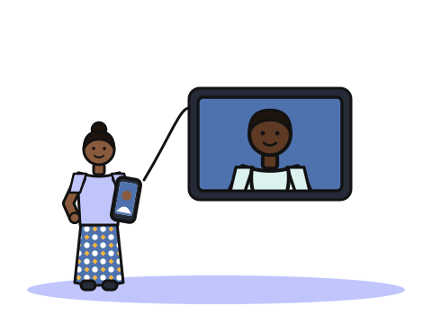<br><b>Télémédecine</b><br><sub>The specialist in Cotonou follows the patient in Kandi, in the same cas.</sub></td>
<td align="center" width="25%" valign="top">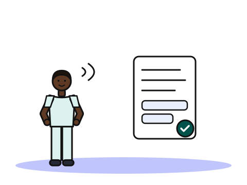<br><b>AI visit assistant</b><br><sub>The soignant dictates and the assistant drafts. Nothing is saved without their approval.</sub></td>
<td align="center" width="25%" valign="top">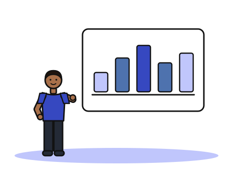<br><b>Lafia Insights</b><br><sub>Dashboards for the ministry and the ARS, computed on anonymised extracts.</sub></td>
</tr>
</table>

Nothing in the critical path depends on a cloud provider. The whole stack is Docker Compose on one virtual machine, ready to be hosted on the State's own infrastructure.

## Read further

- [`docs/architecture.md`](docs/architecture.md): how the running system works, piece by piece and request by request.
- [`docs/adr/`](docs/adr/): the decisions that are hard to reverse, and why.
- [`SYSTEM_PROMPT.md`](SYSTEM_PROMPT.md): the brief, the architecture invariants and the health-data security statement.
- [`CONTEXT.md`](CONTEXT.md): the vocabulary, from cas de visite to relation de soin.
- [`docs/design/charte-graphique.md`](docs/design/charte-graphique.md): the design system, made to be understood without reading.

## Run the stack

Requires Docker with Compose v2. From a clean clone:

```sh
docker compose up -d --build --wait
```

The first start takes a few minutes while HAPI creates its schema. The product site is then served on `https://localhost`, with a door to each application, and each application on its own subdomain: `https://soin.localhost`, `https://caisse.localhost`, `https://pharmacie.localhost`, `https://citoyen.localhost`, `https://numerisation.localhost`, `https://relecture.localhost`. On soin, caisse, pharmacie, numerisation and relecture, `/connexion` lists the demo accounts with their mots de passe. On each subdomain, `/api/<actor>/sante` reports the state of the service and the noyau, `/api/<actor>/docs` is the service's OpenAPI documentation, and `/api/identite/sante` reaches identite. Any other `/api/*` path answers 404: `caisse.localhost` has no route to soin's service.

Locally, the gateway signs `*.localhost` certificates with Caddy's internal authority, so a browser warns until you trust its root, found in the `passerelle` container at `/data/caddy/pki/authorities/local/root.crt`.

At every start, the `chargement` container writes the synthetic dataset from `donnees/` into the noyau (établissements, officines, agents, patients, tarifs, a clinical history), then exits, and identite loads the demo accounts and codes carnet from the same files. Neither deletes anything, so a restart or a redeploy keeps what users created; `docker compose down` keeps the `noyau-donnees` and `identite-donnees` volumes. To start over from the dataset alone:

```sh
docker compose down -v && docker compose up -d --build --wait
```

## Deploy

The live stack runs on an Azure VM and serves the product site on `https://lafia.stephanebah.page` and the applications on `https://soin.lafia.stephanebah.page`, `https://caisse.…`, `https://pharmacie.…`, `https://citoyen.…`, `https://numerisation.…` and `https://relecture.…`. A DNS record for the domain and a wildcard for its subdomains point at the VM; its firewall opens 80 and 443, and SSH to the operator only.

Each deploy of the current `main`, from your machine:

```sh
ssh -i <vm-key.pem> azureuser@lafia.stephanebah.page lafia/deploiement/deployer.sh
```

Setting up a server from scratch, checking a deployment and fixing common failures: `docs/deploiement.md`.

## Configuration

`.env.example` lists every variable. Without a `.env`, the stack runs on local development values; in production, `deploiement/preparer-vm.sh` writes `.env` (git-ignored) with every value. `JETON_CLE_PRIVEE`, which identite alone reads to sign tokens, and `JETON_CLE_PUBLIQUE`, which services read to verify them, may stay empty on `localhost` only, where both sides fall back to the development key pair; on any other domain they refuse to start without a key of their own.

## Web workspace

The applications, the code they share (`web/commun/`) and the design system (`web/design/`) form an npm workspace in `web/`, on Node.js 22. Compose builds each application's image on its own; to work on the code:

```sh
cd web
npm install
npm run typecheck    # every package
npm run build        # every application, as Next.js standalone output
```

## Tests

A black-box suite runs against the running stack through the gateway, as a user or an attacker would, addressing each application by its subdomain. It needs [uv](https://docs.astral.sh/uv/):

```sh
uv run --project tests pytest tests
```

The network isolation checks (`tests/test_isolement.py`) and the dataset checks (`tests/test_donnees.py`) use `docker` on the machine that runs the targeted stack, and are skipped when that stack runs elsewhere.

The same suite checks another deployment by changing the base domain: `LAFIA_DOMAINE=<domaine> uv run --project tests pytest tests`. Locally it connects to `127.0.0.1` and trusts Caddy's internal authority; `LAFIA_ADRESSE` forces the gateway's IP address elsewhere, for instance before DNS is in place.

The suite gets its session tokens by signing in with the demo accounts, read from `donnees/`: it never holds a deployment's private key. Tokens of a wrong shape are forged with the development key, which only a stack served on `localhost` accepts; those tests are skipped elsewhere. Lockout tests use accounts and NPIs reserved for them, never listed on a sign-in page.

Each run counts about twenty failed sign-ins against the machine's address, and identite refuses an address after 50 within 15 minutes: a third run within 15 minutes fails. Locally, clear the counters first:

```sh
docker compose exec base-identite psql -U identite -c "TRUNCATE tentative"
```

## Layout

```
Caddyfile            gateway: one subdomain per actor, one `import acteur <name>` line each
docker-compose.yml   the stack: gateway, noyau, dataset loader, services, identite's database, applications
deploiement/         preparing the VM once, deploying main to it
commun/              shared library, built into each service image: service skeleton, token contract and verification, FHIR client and translation
services/<name>/     one FastAPI service per domain: soin, caisse, pharmacie, citoyen, numerisation, relecture, identite; extraction, internal
services/Dockerfile  one image per service, commun included
donnees/             the synthetic dataset, in Lafia's vocabulary, and the loader that writes it into the noyau; identite reads its accounts from it
web/commun/          shared application code, built into each application: service and identite through the gateway, sign-in page, token renewal
web/design/          design system, built into each application
web/<acteur>/        one Next.js application per actor: soin, caisse, pharmacie, citoyen, numerisation, relecture
web/site/            the product site, on the domain itself; calls no service
tests/               black-box suite through the gateway, one table of actors, network isolation and dataset checks
docs/                how it works (architecture.md), deploying (deploiement.md), specs, ADRs, design
```
